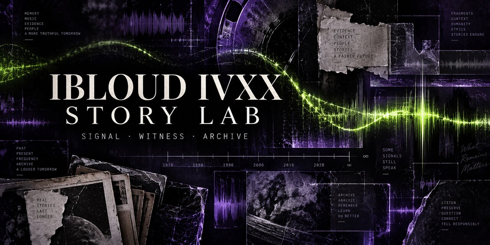

# IBLoud IVXX Story Lab

An independent narrative-and-music research repository documenting how a public online signal can become character, archive, and ethical creative practice.

> **Independent project.** This repository is not affiliated with, endorsed by, or commissioned by G-Eazy, Logic, Megan Thee Stallion, Our Bad Habit, RCA Records, Live Nation, Ticketmaster, the NFL, Lex Nova Lawyer, Thoolie, or the Endless Summer Tour. Nothing here represents private knowledge about any person.

> **Proof-of-concept notice.** Any trailer or episode prototype is an unofficial, noncommercial research demonstration using limited excerpts for criticism, commentary, source identification and analysis. A fair-use rationale is documented for each excerpt, but fair use is context-specific and remains subject to legal review.

## Public story: the hacker and the rapper

A hacker does not break into a rapper's private life. She enters the public machine built around him: feeds, deleted posts, headlines, recommendation systems, music fragments and fan certainty. What begins as an attempt to reconstruct one missing pitch becomes a confrontation with a larger system that turns attention into ownership.

The rapper first experiences the hacker as a threat. She seems to know too much because the network has made scattered public facts feel intimate. The hacker discovers the opposite problem: access to information is not permission, correlation is not truth, and an archive can harm the people it claims to preserve.

Their dramatic conflict is therefore not “Can she expose him?” It is: **Can two creators recover agency from a system that profits when audiences confuse public signals with private truth?**

This is a fictionalized development premise—not a factual claim about any named artist, hacker, relationship or private event. See [STORY-TREATMENT.md](STORY-TREATMENT.md).

## How this story was sourced

OpenAI/ChatGPT did not locate a single verified post containing the remembered “hacker and rapper” pitch. The supplied URL resolved to Tumblr's corporate archive rather than a personal feed. The assistant then reviewed the project sources named by Dominique Devereaux—Loptr Lab, Gerryland/Our Bad Habit, IBLoud IVXX, Audio.com, and the repository's existing G-Eazy research—and assembled a story pattern from the themes visible across those materials.

That means:

| Status | What belongs here |
|---|---|
| **Documented** | A preserved artifact with creator, date, URL/export and verification note |
| **Attributed** | A public statement accurately credited to its speaker |
| **Interpretive** | Loptr Lab's analysis of relationships among artifacts |
| **Fictionalized** | Deliberately invented plot, character action or dialogue |
| **Unresolved** | A remembered source or design decision not yet verified |

The hacker-and-rapper treatment is **Interpretive + Fictionalized**. It must not be cited as recovery of the missing Tumblr post. If that post is later found, it should be archived as a new documented source and compared against this treatment without silently rewriting the provenance record.

**Authorship note:** Dominique Devereaux supplied the underlying project, archives, characters, themes and direction. OpenAI/ChatGPT helped organize, label and articulate the visible architecture. AI assistance is not evidence that the underlying story originated with AI.

## What this repository establishes

IBLoud IVXX did not begin as a conventional album campaign. The character emerged across Tumblr, experimental music, platform memory, and Loptr Lab's reflective practice. This repository makes that dispersed work legible without converting interpretation into fact.

The method follows an established loop:

**Practice → Evidence → Reflection → Analysis → Contribution**

It also repeats the structural logic documented in *Battle the Beast*: a distributed world, a recurring signal, a persistent witness, role-based artifacts, a system that distorts meaning, and an ethical resolution based on the evidence actually available.

## The story pattern

| Function | Battle the Beast | IBLoud IVXX Story Lab |
|---|---|---|
| Networked world | Neitherlands and its fountains | Tumblr, Audio.com, Bluesky, GitHub and the wider platform web |
| Recurring device | Jane Chatwin's watch | Posts, deletion, reposting and rediscovery |
| Persistent witness | Penny remembers across cycles | IBLoud IVXX and the archive retain fragments |
| Navigation | Luna moves through music | Tracks organize emotional and temporal movement |
| Distorting force | The Beast embodies imbalance | Platform amplification turns fragments into certainty |
| Ethical turn | The cycle must be mended | Preserve evidence without claiming private reality |

## Narrative spine

1. **Signal** — a public social-media moment appears during Super Bowl LIV weekend in February 2020.
2. **Amplification** — spectators and media assign romantic and cultural meaning to limited footage.
3. **Contradiction** — Megan Thee Stallion publicly rejects the relationship narrative.
4. **Fragmentation** — posts, reports, reactions and deleted material circulate independently of their original context.
5. **Gerryland** — the public G-Eazy story becomes an interpretive territory rather than a biography.
6. **Witness** — IBLoud IVXX records how platform spectacle affects an observer and creative practice.
7. **Laboratory** — Loptr Lab analyzes authorship, memory, celebrity, rights, accessibility and value.
8. **Return** — the 2026 Endless Summer Tour Part II becomes a present-market test of whether an independent archive can create discovery without manufacturing affiliation.
9. **Mending** — the project documents what can be known, labels what is imagined, and preserves a route for correction.

## Soundtrack map

The existing Audio.com profile functions as a development sketchbook, not a fully cleared commercial soundtrack.

| Track | Story function | Current use status |
|---|---|---|
| iCall | Initiating signal and attempted contact | Research reference pending provenance review |
| GotStudio Addicktion | Creative compulsion | Reference only; uses identified third-party recordings |
| Oragami Must Be Nice | A public identity folded into shape | Research reference pending provenance review |
| Knot Loafers | Status, access and entanglement | Research reference pending provenance review |
| Nasty Game | Celebrity spectacle as conflict | Reference only; uses identified third-party recordings |
| Go Fatale | Character agency and danger | Reference only; uses identified third-party recordings |
| Violet Murderer | Shadow-self or imagined antagonist | Research reference pending provenance review |
| Pain A Human Has 2 Go Through | Human consequence | Research reference pending provenance review |
| 50 Ways to Leave Another | Betrayal and severance | Original/Suno versions require separate documentation |

The repository does **not** redistribute those recordings. See [TRACKLIST.md](TRACKLIST.md) and [RIGHTS.md](RIGHTS.md).

## Present-market use

The project can function in today's market as:

- a **narrative proof of concept** for transmedia development;
- an **auditable music-development notebook** for producers and supervisors;
- an **ethical fan-adjacent case study** for artist management and live-event teams;
- a **rights-aware catalogue incubator** for replacing uncleared mashups with original compositions;
- a **local discovery funnel** connecting Minneapolis-area cultural research to the September 18, 2026 Shakopee tour stop; and
- a **research object** about platform memory, attribution, accessibility and creator compensation.

The repository is the evidence layer. Social posts are distribution. Official ticketing pages remain the only purchase destination.

## Market activation: 2026 return

The Endless Summer Tour Part II is publicly listed as a 23-show North American tour beginning September 15, 2026. The Minneapolis-area performance is scheduled for September 18 at Mystic Lake Amphitheater in Shakopee, Minnesota.

This project may discuss that tour as a current cultural event and link to official ticketing. It must not:

- call IBLoud IVXX's work an official soundtrack;
- use official tour marks or artwork without permission;
- imply that ticket revenue supports Loptr Lab;
- state that an artist, manager, promoter, venue or label has seen or approved the project; or
- claim ticket-sales impact without attributable conversion data.

See [MARKET-USE.md](MARKET-USE.md) for the campaign model.

## Rights and waterfall

[WATERFALL.md](WATERFALL.md) separates a film/series receipts waterfall from music royalties, tour/ticket income and the project's experimental contributor allocation. No percentage is binding until the relevant parties sign agreements after qualified entertainment-law, tax and accounting review.

The legal-development route starts with [Lex Nova Lawyer/Thoolie](https://linktr.ee/lexnovalawyer), used here as an educational and attorney-contact resource. Its materials do not create an attorney-client relationship, clear any asset or endorse this project.

Standing rule: **Label fiction. Verify authorization. Respect creators. Never confuse availability with permission.**

## Repository guide

- [STORY-TREATMENT.md](STORY-TREATMENT.md) — public hacker-and-rapper feature/limited-series treatment
- [CHARACTER.md](CHARACTER.md) — IBLoud IVXX's dramatic function and boundaries
- [STORY-ARC.md](STORY-ARC.md) — repeatable transmedia structure
- [TRACKLIST.md](TRACKLIST.md) — soundtrack roles and replacement plan
- [MARKET-USE.md](MARKET-USE.md) — current-market applications and measurement
- [RIGHTS.md](RIGHTS.md) — clearance framework and licensing limits
- [WATERFALL.md](WATERFALL.md) — provisional receipts and contributor-participation model
- [CLEARANCE-LEDGER.md](CLEARANCE-LEDGER.md) — asset-by-asset review table
- [AI-DISCLOSURE.md](AI-DISCLOSURE.md) — Suno workflow and human-authorship record
- [SOURCES.md](SOURCES.md) — public sources and verification notes
- [CONTRIBUTING.md](CONTRIBUTING.md) — evidence and corrections protocol
- [FAIR-USE-PROOF-OF-CONCEPT.md](FAIR-USE-PROOF-OF-CONCEPT.md) — excerpt-selection and labeling protocol
- [TRAILER-TREATMENT.md](TRAILER-TREATMENT.md) — 90-second proof-of-concept structure
- [TRAILER-CLIP-LEDGER.csv](TRAILER-CLIP-LEDGER.csv) — clip-level purpose, duration and rights review

## Status

**Research prototype / fictional treatment / fair-use rationale documented / legal review required.** No trailer excerpt is represented as licensed merely because it is labeled as fair use. No soundtrack track is represented as cleared for commercial synchronization unless the clearance ledger says `CLEARED` and identifies the supporting agreement.
